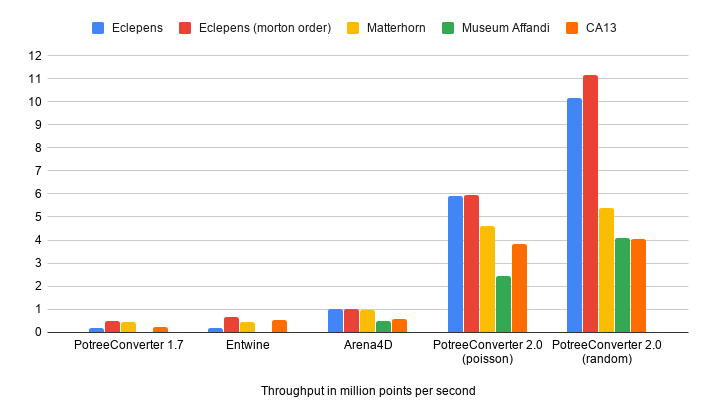

# About

PotreeConverter generates an octree LOD structure for streaming and real-time rendering of massive point clouds. The results can be viewed in web browsers with [Potree](https://github.com/potree/potree) or as a desktop application with [PotreeDesktop](https://github.com/potree/PotreeDesktop). 

Version 2.0 is a complete rewrite with following differences over the previous version 1.7:

* About 10 to 50 times faster than PotreeConverter 1.7 on SSDs.
* Produces a total of 3 files instead of thousands to tens of millions of files. The reduction of the number of files improves file system operations such as copy, delete and upload to servers from hours and days to seconds and minutes. 
* Better support for standard LAS attributes and arbitrary extra attributes. Full support (e.g. int64 and uint64) in development.
* Optional compression is not yet available in the new converter but on the roadmap for a future update.

Altough the converter made a major step to version 2.0, the format it produces is also supported by Potree 1.7. The Potree viewer is scheduled to make the major step to version 2.0 in 2021, with a rewrite in WebGPU. 

# Publications

* [Potree: Rendering Large Point Clouds in Web Browsers](https://www.cg.tuwien.ac.at/research/publications/2016/SCHUETZ-2016-POT/SCHUETZ-2016-POT-thesis.pdf)
* [Fast Out-of-Core Octree Generation for Massive Point Clouds](https://www.cg.tuwien.ac.at/research/publications/2020/SCHUETZ-2020-MPC/), _Schütz M., Ohrhallinger S., Wimmer M._

# Getting Started

1. Download windows binaries or
    * Download source code
	* Install [CMake](https://cmake.org/) 3.16 or later
	* Create and jump into folder "build"
	    ```
	    mkdir build
	    cd build
	    ```
	* run 
	    ```
	    cmake ../
	    ```
	* On linux, run: ```make```
	* On windows, open Visual Studio 2019 Project ./Converter/Converter.sln and compile it in release mode
2. run ```PotreeConverter.exe <input> -o <outputDir>```
    * Optionally specify the sampling strategy:
	* Poisson-disk sampling (default): ```PotreeConverter.exe <input> -o <outputDir> -m poisson```
	* Random sampling: ```PotreeConverter.exe <input> -o <outputDir> -m random```

In Potree, modify one of the examples with following load command:

```javascript
let url = "../pointclouds/D/temp/test/metadata.json";
Potree.loadPointCloud(url).then(e => {
	let pointcloud = e.pointcloud;
	let material = pointcloud.material;

	material.activeAttributeName = "rgba";
	material.minSize = 2;
	material.pointSizeType = Potree.PointSizeType.ADAPTIVE;

	viewer.scene.addPointCloud(pointcloud);
	viewer.fitToScreen();
});

```

# Alternatives

PotreeConverter 2.0 produces a very different format than previous iterations. If you find issues, you can still try previous converters or alternatives:

<table>
	<tr>
		<th></th>
		<th>PotreeConverter 2.0</th>
		<th><a href="https://github.com/potree/PotreeConverter/releases/tag/1.7">PotreeConverter 1.7</a></th>
		<th><a href="https://entwine.io/">Entwine</a></th>
	</tr>
	<tr>
		<th>license</th>
		<td>
			free, BSD 2-clause
		</td>
		<td>
			free, BSD 2-clause
		</td>
		<td>
			free, LGPL
		</td>
	</tr>
	<tr>
		<th>#generated files</th>
		<td>
			3 files total
		</td>
		<td>
			1 per node
		</td>
		<td>
			1 per node
		</td>
	</tr>
	<tr>
		<th>compression</th>
		<td>
			none (TODO)
		</td>
		<td>
			LAZ (optional)
		</td>
		<td>
			LAZ
		</td>
	</tr>
</table>

Performance comparison (Ryzen 2700, NVMe SSD):



# License 

PotreeConverter is available under the [BSD 2-clause license](./LICENSE).